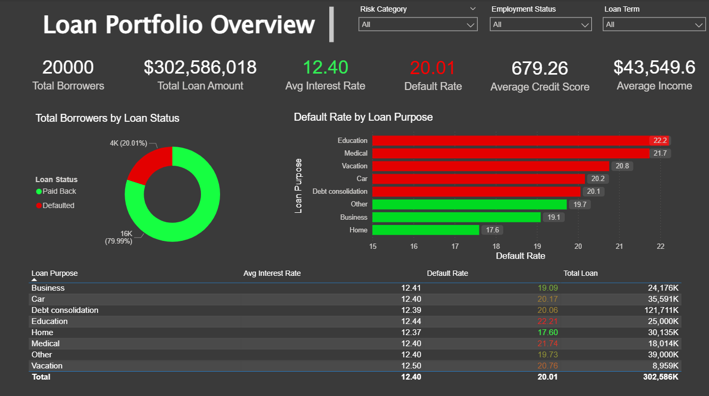
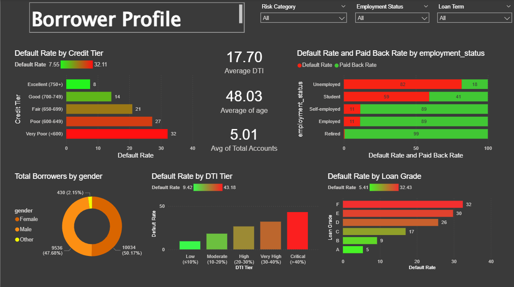
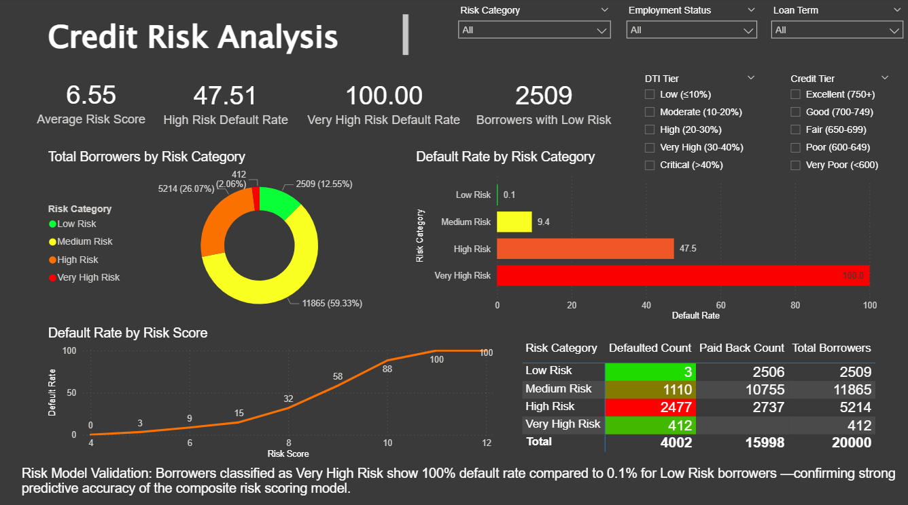

# 🏦 Bank Loan Default Analysis — Dashboard & SQL Ad Hoc Analysis


## 📌 Project Overview

This project provides a **comprehensive analysis of bank loan data**
focused on understanding **loan defaults, borrower profiles, and risk
assessment** using:
- **SQL** — for ad hoc querying, KPI generation, and data exploration
- **Power BI** — for interactive dashboard visualization

The goal is to identify key factors driving loan defaults, analyze
borrower demographics, and validate the risk scoring model for
data-driven lending decisions.

---

## 🗂️ Table of Contents
- [Problem Statement](#-problem-statement)
- [Dashboards](#-dashboards)
- [SQL Ad Hoc Analysis](#-sql-ad-hoc-analysis)
- [Key Insights](#-key-insights)
- [Tools Used](#️-tools-used)
- [How to Use](#-how-to-use)
- [Contact](#-contact)

---

## 🎯 Problem Statement

The bank needs to understand its loan portfolio performance and identify
the key drivers behind loan defaults. This project analyzes:
- Overall portfolio health — total borrowers, loan amounts, default rates
- Borrower demographics — age, gender, employment status, income
- Credit & risk factors — credit tier, DTI tier, loan grade, risk score
- Loan characteristics — purpose, term, interest rates
- Risk model validation — evaluating the composite risk scoring model

---

## 📊 Dashboards

### 1️⃣ Loan Portfolio Overview
> High-level portfolio snapshot with default rate analysis by loan purpose.



**Key KPIs:**
| KPI | Value |
|-----|-------|
| Total Borrowers | 20,000 |
| Total Loan Amount | \$302,586,018 |
| Avg Interest Rate | 12.40% |
| Default Rate | 20.01% |
| Average Credit Score | 679.26 |
| Average Income | \$43,549.6 |

**Visuals:**
| Chart | Purpose |
|-------|---------|
| 🍩 Donut Chart | Total Borrowers by Loan Status (Paid Back vs Defaulted) |
| 📊 Bar Chart | Default Rate by Loan Purpose |
| 📋 Table | Loan Purpose breakdown — Avg Interest Rate, Default Rate, Total Loan |

**Filters:** Risk Category, Employment Status, Loan Term

---

### 2️⃣ Borrower Profile
> Deep dive into borrower demographics and their impact on default rates.



**Key KPIs:**
| KPI | Value |
|-----|-------|
| Average DTI | 17.70 |
| Average Age | 48.03 |
| Avg Total Accounts | 5.01 |

**Visuals:**
| Chart | Purpose |
|-------|---------|
| 📊 Bar Chart | Default Rate by Credit Tier (Excellent to Very Poor) |
| 📊 Stacked Bar Chart | Default Rate & Paid Back Rate by Employment Status |
| 🍩 Donut Chart | Total Borrowers by Gender (Male, Female, Other) |
| 📊 Bar Chart | Default Rate by DTI Tier (Low to Critical) |
| 📊 Bar Chart | Default Rate by Loan Grade (A to F) |

**Filters:** Risk Category, Employment Status, Loan Term

---

### 3️⃣ Risk Analysis Dashboard
> Risk model validation with default rate analysis across risk categories
> and risk scores.



**Key KPIs:**
| KPI | Value |
|-----|-------|
| Average Risk Score | 6.67 |
| High Risk Default Rate | 43.46% |
| Very High Risk Default Rate | 91.21% |
| Borrowers with Low Risk | 2,298 |

**Visuals:**
| Chart | Purpose |
|-------|---------|
| 🍩 Donut Chart | Total Borrowers by Risk Category (Low, Medium, High, Very High) |
| 📊 Bar Chart | Default Rate by Risk Category |
| 📈 Line Chart | Default Rate by Risk Score |
| 📋 Table | Risk Category — Defaulted Count, Paid Back Count, Total Borrowers |

**Risk Model Validation:**
> Borrowers classified as Very High Risk show 91.2% default rate compared
> to 0.1% for Low Risk borrowers — a 91 percentage point difference,
> confirming strong predictive accuracy of the composite risk scoring model.

**Filters:** Risk Category, Employment Status, Loan Term, DTI Tier, Credit Tier

---

## 🛢️ SQL Ad Hoc Analysis

All SQL queries used for data extraction, KPI calculation, and analysis
are available in
[`SQL_Analysis/Bank_Loan_Ad_Hoc_Analysis.sql`](SQL_Analysis/Bank_Loan_Ad_Hoc_Analysis.sql)

### Queries Include:

#### 📌 A. Portfolio Level KPIs

```sql
-- Total Borrowers
SELECT COUNT(*) AS Total_Borrowers FROM bank_loan_data;

-- Total Loan Amount
SELECT SUM(loan_amount) AS Total_Loan_Amount FROM bank_loan_data;

-- Average Interest Rate
SELECT ROUND(AVG(interest_rate), 2) AS Avg_Interest_Rate FROM bank_loan_data;

-- Overall Default Rate
SELECT
    ROUND(COUNT(CASE WHEN loan_status = 'Defaulted' THEN 1 END) * 100.0
    / COUNT(*), 2) AS Default_Rate
FROM bank_loan_data;

-- Average Credit Score
SELECT ROUND(AVG(credit_score), 2) AS Avg_Credit_Score FROM bank_loan_data;

-- Average Income
SELECT ROUND(AVG(income), 2) AS Avg_Income FROM bank_loan_data;

-- Average DTI
SELECT ROUND(AVG(dti), 2) AS Avg_DTI FROM bank_loan_data;

-- Average Age
SELECT ROUND(AVG(age), 2) AS Avg_Age FROM bank_loan_data;

-- Average Total Accounts
SELECT ROUND(AVG(total_accounts), 2) AS Avg_Total_Accounts FROM bank_loan_data;

-- Default Rate by Credit Tier
SELECT
    credit_tier,
    COUNT(*) AS Total_Borrowers,
    ROUND(COUNT(CASE WHEN loan_status = 'Defaulted' THEN 1 END) * 100.0
    / COUNT(*), 2) AS Default_Rate
FROM bank_loan_data
GROUP BY credit_tier
ORDER BY Default_Rate;

-- Default Rate by Employment Status
SELECT
    employment_status,
    COUNT(*) AS Total_Borrowers,
    ROUND(COUNT(CASE WHEN loan_status = 'Defaulted' THEN 1 END) * 100.0
    / COUNT(*), 2) AS Default_Rate,
    ROUND(COUNT(CASE WHEN loan_status = 'Paid Back' THEN 1 END) * 100.0
    / COUNT(*), 2) AS Paid_Back_Rate
FROM bank_loan_data
GROUP BY employment_status;

-- Total Borrowers by Gender
SELECT
    gender,
    COUNT(*) AS Total_Borrowers,
    ROUND(COUNT(*) * 100.0 / (SELECT COUNT(*) FROM bank_loan_data), 2)
    AS Percentage
FROM bank_loan_data
GROUP BY gender;

-- Default Rate by DTI Tier
SELECT
    dti_tier,
    ROUND(COUNT(CASE WHEN loan_status = 'Defaulted' THEN 1 END) * 100.0
    / COUNT(*), 2) AS Default_Rate
FROM bank_loan_data
GROUP BY dti_tier;

-- Default Rate by Loan Grade
SELECT
    loan_grade,
    ROUND(COUNT(CASE WHEN loan_status = 'Defaulted' THEN 1 END) * 100.0
    / COUNT(*), 2) AS Default_Rate
FROM bank_loan_data
GROUP BY loan_grade
ORDER BY loan_grade;

-- Loan Status Distribution
SELECT
    loan_status,
    COUNT(*) AS Total_Borrowers,
    ROUND(COUNT(*) * 100.0 / (SELECT COUNT(*) FROM bank_loan_data), 2)
    AS Percentage
FROM bank_loan_data
GROUP BY loan_status;

-- Default Rate by Loan Purpose
SELECT
    loan_purpose,
    ROUND(AVG(interest_rate), 2) AS Avg_Interest_Rate,
    ROUND(COUNT(CASE WHEN loan_status = 'Defaulted' THEN 1 END) * 100.0
    / COUNT(*), 2) AS Default_Rate,
    SUM(loan_amount) AS Total_Loan
FROM bank_loan_data
GROUP BY loan_purpose
ORDER BY Default_Rate DESC;

-- Average Risk Score
SELECT ROUND(AVG(risk_score), 2) AS Avg_Risk_Score FROM bank_loan_data;

-- Default Rate by Risk Category
SELECT
    risk_category,
    COUNT(*) AS Total_Borrowers,
    COUNT(CASE WHEN loan_status = 'Defaulted' THEN 1 END) AS Defaulted_Count,
    COUNT(CASE WHEN loan_status = 'Paid Back' THEN 1 END) AS Paid_Back_Count,
    ROUND(COUNT(CASE WHEN loan_status = 'Defaulted' THEN 1 END) * 100.0
    / COUNT(*), 2) AS Default_Rate
FROM bank_loan_data
GROUP BY risk_category
ORDER BY Default_Rate;

-- Default Rate by Risk Score
SELECT
    risk_score,
    ROUND(COUNT(CASE WHEN loan_status = 'Defaulted' THEN 1 END) * 100.0
    / COUNT(*), 2) AS Default_Rate
FROM bank_loan_data
GROUP BY risk_score
ORDER BY risk_score;

-- Risk Model Validation
SELECT
    risk_category,
    COUNT(CASE WHEN loan_status = 'Defaulted' THEN 1 END) AS Defaulted_Count,
    COUNT(CASE WHEN loan_status = 'Paid Back' THEN 1 END) AS Paid_Back_Count,
    COUNT(*) AS Total_Borrowers,
    ROUND(COUNT(CASE WHEN loan_status = 'Defaulted' THEN 1 END) * 100.0
    / COUNT(*), 2) AS Default_Rate
FROM bank_loan_data
GROUP BY risk_category
ORDER BY Default_Rate;


---

## 💡 Key Insights

- 📊 **20.01% overall default rate** across 20,000 borrowers
- 🏦 **\$302.5M total loan portfolio** with average interest rate of 12.40%
- 🎓 **Education loans** have the highest default rate (22.2%), followed
  by Medical (21.7%) and Vacation (20.8%)
- 📉 **Very Poor credit tier (<600)** has the highest default rate (32%)
  vs Excellent (750+) at just 8%
- 👥 **Unemployed borrowers** have the highest default rate (82%),
  while Retired have the lowest (1%)
- 🚨 **Very High Risk borrowers** default at 91.2% vs 0.1% for Low Risk
  — confirming the risk model's strong predictive accuracy
- 📈 Default rate **increases sharply** as risk score increases from 4 to 12
- ⚖️ **Critical DTI tier (>40%)** shows the highest default rate (43.18%)
- 📊 **Loan Grade F** has the highest default rate (32%), decreasing
  steadily to Grade A (5%)
- 👨‍👩‍👧 Gender split is nearly balanced — Male (50.17%), Female (47.68%),
  Other (2.15%)

---

## 🛠️ Tools Used

| Tool | Purpose |
|------|---------|
| **SQL Server** | Data querying, KPI calculation, ad hoc analysis |
| **Power BI** | Interactive dashboard creation (3 dashboards) |
| **GitHub** | Version control & project documentation |

---

## 🚀 How to Use

1. **Clone this repository:**
   ```bash
   git clone https://github.com/YOUR_USERNAME/Bank-Loan-Analysis.git


---

## 📁 Data Dictionary

| Column | Description |
|--------|-------------|
| `age` | Borrower's age |
| `gender` | Male / Female / Other |
| `income` | Borrower's annual income |
| `credit_score` | Borrower's credit score |
| `credit_tier` | Excellent / Good / Fair / Poor / Very Poor |
| `employment_status` | Employed / Self-employed / Unemployed / Student / Retired |
| `loan_amount` | Loan amount |
| `loan_purpose` | Education / Medical / Business / Home / Car / Debt Consolidation / Vacation / Other |
| `loan_term` | Loan term duration |
| `loan_grade` | A through F |
| `interest_rate` | Interest rate on loan |
| `dti` | Debt-to-Income ratio |
| `dti_tier` | Low / Moderate / High / Very High / Critical |
| `total_accounts` | Total number of accounts |
| `loan_status` | Paid Back / Defaulted |
| `risk_score` | Composite risk score |
| `risk_category` | Low Risk / Medium Risk / High Risk / Very High Risk |

---

## 📬 Contact

**Jitesh Raizada**
- 🔗 [LinkedIn](ttps:/linkedin.com/in/jitesh-raizada)
- 📧 jiteshraizada@gmail.com
- 💻 [GitHub](https://github.com/jitesh_raizada)

---

⭐ **If you found this project useful, please give it a star!**
